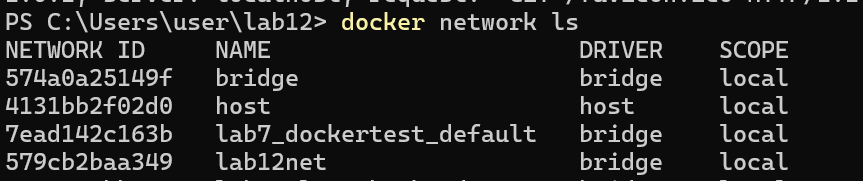
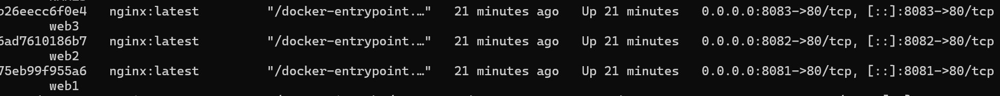
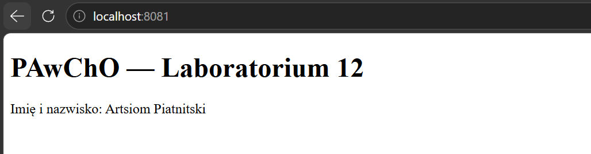
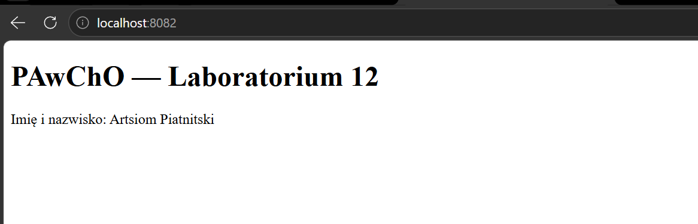
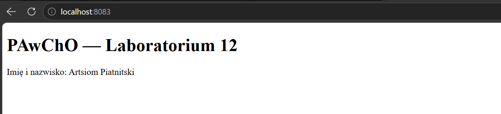
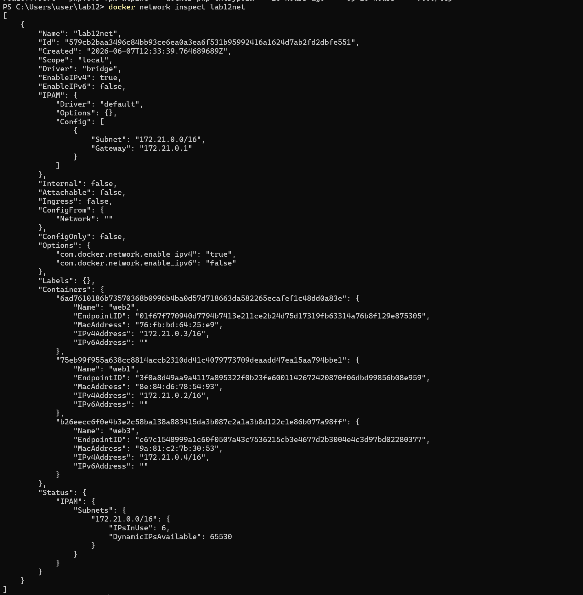
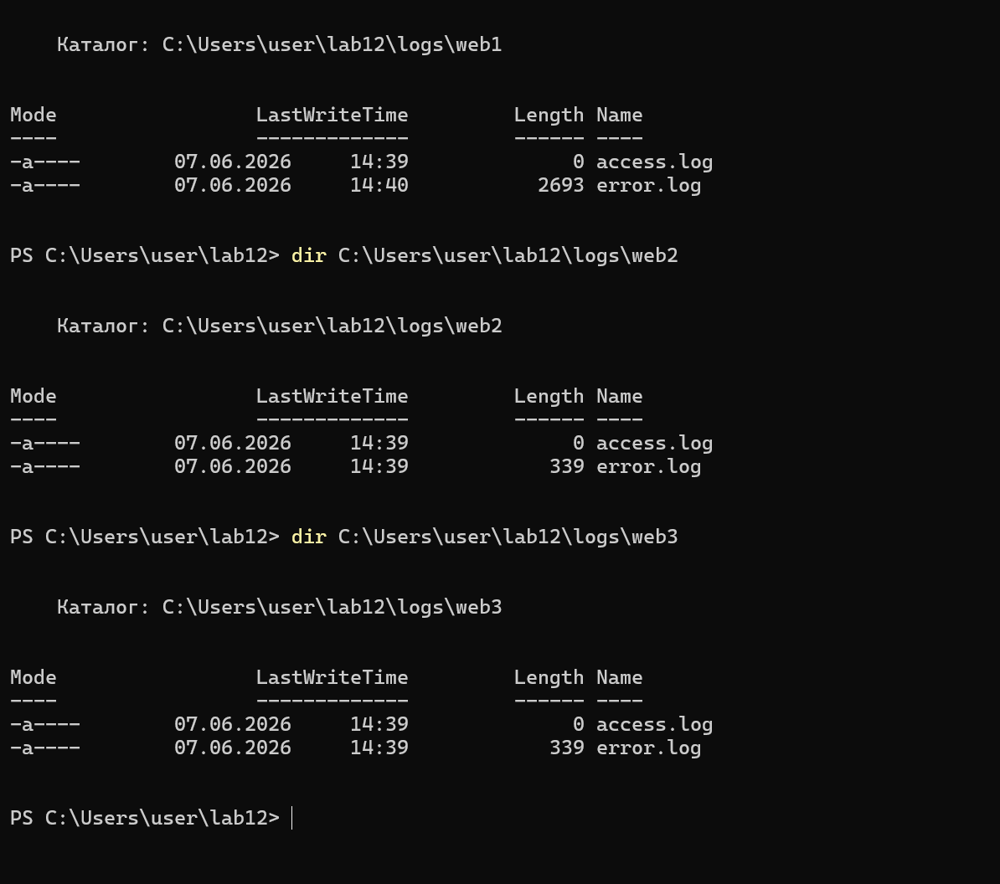

# PAwChO — Laboratorium 12

## Autor

**Artsiom Piatnitski**

## Cel ćwiczenia

Celem laboratorium było utworzenie własnej sieci mostkowej Docker oraz uruchomienie trzech kontenerów nginx korzystających ze wspólnego zasobu HTML i zapisujących logi do katalogów systemu gospodarza.

---

## Utworzenie sieci Docker

Polecenie:

```bash
docker network create lab12net
```

Weryfikacja:

```bash
docker network ls
```



---

## Uruchomienie kontenerów

### web1

```bash
docker run -d --name web1 --network lab12net -p 8081:80 -v C:\Users\user\lab12\html:/usr/share/nginx/html:ro -v C:\Users\user\lab12\logs\web1:/var/log/nginx nginx:latest
```

### web2

```bash
docker run -d --name web2 --network lab12net -p 8082:80 -v C:\Users\user\lab12\html:/usr/share/nginx/html:ro -v C:\Users\user\lab12\logs\web2:/var/log/nginx nginx:latest
```

### web3

```bash
docker run -d --name web3 --network lab12net -p 8083:80 -v C:\Users\user\lab12\html:/usr/share/nginx/html:ro -v C:\Users\user\lab12\logs\web3:/var/log/nginx nginx:latest
```

Sprawdzenie działania:

```bash
docker ps
```



---

## Strona HTML

Kod strony:

```html
<!DOCTYPE html>
<html>
<head>
    <meta charset="UTF-8">
    <title>Laboratorium 12</title>
</head>
<body>
    <h1>PAwChO — Laboratorium 12</h1>
    <p>Imię i nazwisko: Artsiom Piatnitski</p>
</body>
</html>
```

Dostęp do stron:

- http://localhost:8081
- http://localhost:8082
- http://localhost:8083







---

## Weryfikacja sieci

Polecenie:

```bash
docker network inspect lab12net
```



---

## Weryfikacja logów

Katalog web1,Katalog web2,Katalog web3:: 




Przykładowa zawartość logu:


---

## Wnioski

Utworzono sieć mostkową Docker o nazwie `lab12net`. Uruchomiono trzy kontenery nginx (`web1`, `web2`, `web3`) dostępne z poziomu komputera hosta. Wszystkie kontenery korzystały ze wspólnego pliku HTML podłączonego jako wolumen tylko do odczytu (`read-only`). Logi serwerów były zapisywane do oddzielnych katalogów na hoście i były dostępne poza kontenerami.